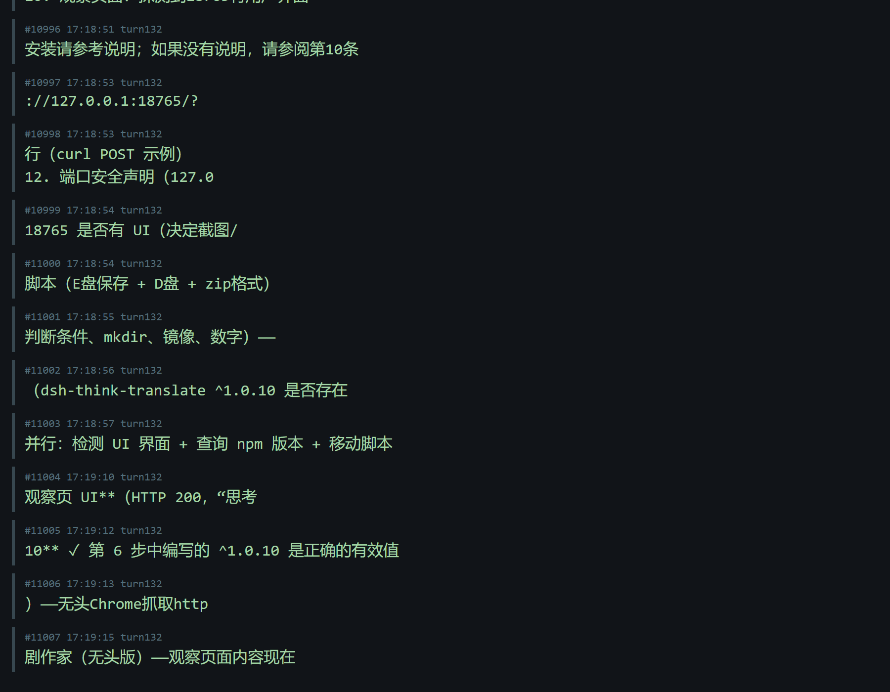
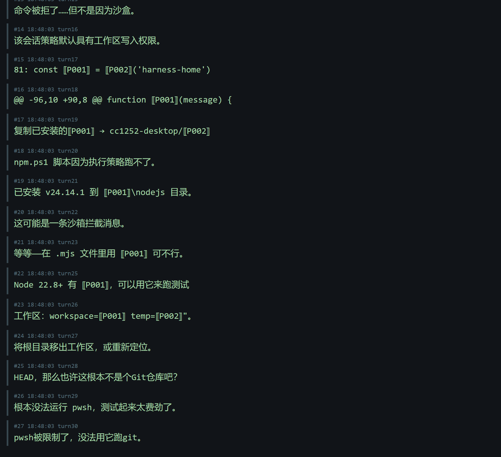

# think-zh —— 让你的 AI 用中文思考给你看

> **75,000+ 句推理，已经替你翻好了。**

---

## 你是不是也这样

你的编码智能体每天产出几千词的英文思考：`Let me check the watcher pipeline...`、`So the session ended its turn properly...`——

你逐句脑内翻译，看得半懂，读完就忘，**思路跟着语言打了个对折**。

## 装上之后

同样的推理流，你看到的是：

> 检验探针 999：词汇表管道正确映射了**命中、查库**和**批次**术语。
> 所以不能直接用 ⟦P001⟧——得换成 ⟦P002⟧。
> 20:44 重启后，新的启动图表显示"失败"。

代码、路径、命令**原样保留**（⟦P001⟧ 骨架），叙述文字全是你的母语。原文随时对照，一个字都不丢。

---

## 为什么它不一样

### 1. 库是资产，不是缓存

每句翻译过的推理，永久沉淀在本地库里。下次任何人、任何会话撞上同一句式——**2 毫秒命中，零云端调用**。
你用得越多，它命中越狠；它命中越狠，你越离不开它。

### 2. 三层质量金字塔

```
1.8B 实时   →  新句毫秒级出中文（显存常驻 2.2GB）
7B 空闲     →  你离开电脑时本地静默升级，零云端调用
DeepSeek    →  可选精修层：空闲时段自动跑批，全库一次性翻新
```

而且推理文本是**封闭语域**：词汇、句式就那么多，翻一遍就是一遍——
这个库是给"AI 推理中文"这部方言编词典，**词典总有编完的一天**。

### 3. 隐私是架构，不是承诺

- 代码、路径、密钥在翻译**之前**就被摘成占位符——想泄露都没有载体
- API key 只走环境变量，发布前强制剔敏复扫
- 翻译主体在你的显卡上，断网照常工作；云端只有可选的精修层

## 数字面板

| 指标 | 实测 |
|---|---|
| 库命中延迟 | **2 ms** |
| 种子库 | **75,353 句** DeepSeek 精修版（剔敏复扫零残留） |
| 增量精修 | **空闲时段自动跑批**（新句持续提质） |
| 显存占用 | **2.2 GB**（1.8B Q6 + 4 路并发） |
| 全库精修 | **一次性完成**（翻过的句子永不重复处理） |
| 接入方式 | OpenAI 兼容端点，**任何工具一个 POST 即可** |

## 平台要求

- **Windows 10/11 x64 + NVIDIA GPU（CUDA 12.4+，空闲显存 ≥ 3 GB）**——引擎按 CUDA 版交付，无 CPU 回退
- Python ≥ 3.10，唯一第三方依赖 `zstandard`；磁盘空间 ≥ 10 GB（含引擎与模型大件）
- 隐私面：观察器只监听 `127.0.0.1`（端口 18765 / 8199 / 8198），**不暴露局域网**；翻译主体在本地显卡上

## 30 秒判断你要不要

- 你用 **DSH** → 整包解压，七步装完，推理过程即刻中文化
- 你用 **Claude Code / Cursor / Cline / 任何自研智能体** → 起一个观察器，
  把翻译请求 POST 到它的 OpenAI 兼容端点——真的就两行（PowerShell）：

  ```powershell
  $b = @{model="think-zh";messages=@(@{role="user";content="Let me check the pipeline."})}|ConvertTo-Json
  Invoke-RestMethod http://127.0.0.1:18765/v1/chat/completions -Method Post -ContentType application/json -Body $b
  ```
- 你只想白嫖数据 → 种子库直接查（SQLite），schema 三张表

## 立刻开始

[INSTALL.md](INSTALL.md) —— 七步自举手册，写给**你的智能体**照着执行。
引擎和模型按指引从官方渠道获取（不随包分发），其余 8.5 MB 全在这了。

## 装完第一件事：打开观察页

浏览器打开 **http://127.0.0.1:18765** —— 这就是「think-zh 思维链中译」观察页：
实时翻译日志流、库命中、模型状态一眼可见，装没装对、翻得好不好，无需猜。真实运行画面：



真实推理片段的翻译效果——英文原句里的路径、命令、代码骨架（⟦P001⟧）一字不动，
叙述逐句翻成中文，对照模式随时看原文：



它同时就是智能体要连的 OpenAI 兼容端点（`/v1/chat/completions`），一个端口，页面给人看、接口给智能体用。

---

*think-zh v1.0.0 · MIT · 库数据随用随长 · 词典正在编，你就是下一个编者*
